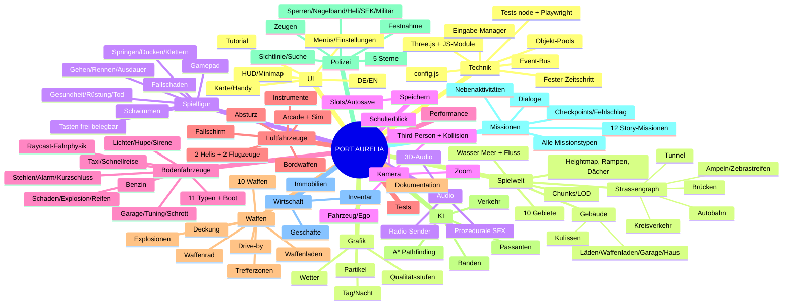

# MINDMAP – „PORT AURELIA“ (Open-World-Spiel im GTA-Stil, eigene Erfindung)

Legende: `[x]` erledigt · `[~]` vereinfacht umgesetzt · `[x]` offen
Meilenstein-Zuordnung in Klammern (M0 … M12). Diese Datei wird während der Arbeit laufend abgehakt.

> Stand dieser Datei: siehe Abschnitt „Status“ ganz unten (wird bei jedem Meilenstein aktualisiert).

---

## Baumstruktur

```
PORT AURELIA
├── 1. Technik und Projektaufbau (M0)
│   ├── [x] Technologie-Vergleich (≥3 Optionen) → TECH_ENTSCHEIDUNG.md
│   ├── [x] Git-Repository, Branch, .gitignore
│   ├── [x] Ordnerstruktur src/{core,world,player,vehicles,aircraft,weapons,ai,police,missions,economy,ui,audio,save,fx}
│   ├── [x] Three.js lokal einbinden (vendor/, keine CDN-Abhängigkeit)
│   ├── [x] Start ohne Installation: start.js (Node, ohne Abhängigkeiten) + Einzeldatei-Build dist/PortAurelia.html
│   ├── [x] Spielschleife mit festem Physik-Zeitschritt (1/60 s, Akkumulator)
│   ├── [x] Zentrale Eingabeverwaltung (Tastatur, Maus, Gamepad, Aktionen statt Tasten)
│   ├── [x] Event-System (Pub/Sub-Bus)
│   ├── [x] Konfigurationsdatei für alle Spielwerte (src/config.js)
│   ├── [x] Objekt-Pooling (Projektile, Partikel, Passanten, Autos)
│   ├── [x] Mathematische Hilfsfunktionen, Zufallsgenerator mit Seed
│   ├── [x] Automatisierte Tests (node --test) für Logik-Module
│   └── [x] Browser-Smoke-Test (Playwright, Screenshot, Fehlerprüfung, FPS)
│
├── 2. Spielwelt (M1)
│   ├── Stadtplan / Gebiete
│   │   ├── [x] Innenstadt mit Hochhäusern
│   │   ├── [x] Wohnviertel
│   │   ├── [x] Industriegebiet
│   │   ├── [x] Hafen (Kräne, Container, Docks)
│   │   ├── [x] Strand / Küste
│   │   ├── [x] Vorort
│   │   ├── [x] Park
│   │   ├── [x] Flughafen (Startbahn, Tower, Hangar)
│   │   ├── [x] Militärgelände (Zaun, Wachen, Hubschrauber, Jet)
│   │   └── [x] Berge / Land mit Wald
│   ├── Strassennetz
│   │   ├── [x] Strassengraph (Knoten + Kanten als Polylinien)
│   │   ├── [x] Kreuzungen
│   │   ├── [x] Autobahn (Ring, breiter)
│   │   ├── [x] Brücken über den Fluss
│   │   ├── [x] Tunnel durch einen Berg
│   │   ├── [x] Kreisverkehr
│   │   ├── [x] Bürgersteige
│   │   ├── [x] Zebrastreifen
│   │   └── [x] Ampeln mit Phasen
│   ├── Gebäude
│   │   ├── [x] Kulissengebäude mit Fenster-Texturen (prozedural)
│   │   ├── [x] Betretbar: Läden (Laden-Innenraum)
│   │   ├── [x] Betretbar: Waffenladen
│   │   ├── [x] Betretbar: Garage
│   │   └── [x] Betretbar: Haus des Spielers (Bett = Speichern)
│   ├── [x] Wasser: Meer + Fluss, Schwimmen
│   ├── [x] Höhenunterschiede (Heightmap), Rampen, Treppen, begehbare Dächer
│   ├── [x] Tag-und-Nacht-Zyklus (→ Ast 13)
│   ├── [x] Wettersystem (→ Ast 13)
│   ├── [x] Minimap + Vollbildkarte mit Markierungen (→ Ast 12)
│   ├── [x] Weltgrenze (Ozean + unsichtbare Wand)
│   └── [~] Chunks mit Distanz-Streaming / LOD, Frustum Culling
│
├── 3. Spielfigur und Steuerung (M1)
│   ├── [x] Gehen, Laufen, Rennen mit Ausdauer
│   ├── [x] Springen, Ducken
│   ├── [x] Klettern über niedrige Hindernisse
│   ├── [x] Schwimmen (Ausdauer, Tauchen nicht)
│   ├── [x] Fallen mit Fallschaden
│   ├── [x] Kollision mit Gebäuden/Objekten (AABB + Höhenabfrage)
│   ├── [x] Tastatur + Maus (Pointer Lock)
│   ├── [~] Gamepad (Standard-Mapping)
│   ├── [x] Frei belegbare Tasten
│   ├── [x] Gesundheit, Rüstung, Ausdauer
│   ├── [x] Tod → Krankenhaus mit Geldabzug
│   ├── [~] Prozedurale Animationen: Stehen, Gehen, Rennen, Springen, Schwimmen, Schiessen, Ein-/Aussteigen
│   └── [x] Rettung: Stuck-Erkennung, Durch-Boden-Fallen → Reset
│
├── 4. Kamera (M1)
│   ├── [x] Dritte-Person-Orbitkamera mit Maus
│   ├── [x] Kamera-Kollision (Raycast gegen Gebäude)
│   ├── [x] Über-die-Schulter-Zielmodus
│   ├── [x] Fahrzeugkamera (Verfolger), Ego-Perspektive im Fahrzeug
│   ├── [x] Flugkamera (weiter weg, folgt Rollachse leicht)
│   └── [x] Zoom beim Scharfschützengewehr
│
├── 5. Fahrzeuge am Boden (M2)
│   ├── Typen
│   │   ├── [x] Kleinwagen  ├── [x] Limousine  ├── [x] Sportwagen
│   │   ├── [x] SUV/Pickup   ├── [x] Lastwagen   ├── [x] Bus
│   │   ├── [x] Motorrad     ├── [x] Polizeiauto ├── [x] Krankenwagen
│   │   ├── [x] Taxi         ├── [x] Feuerwehr   └── [x] Motorboot
│   ├── Fahrphysik (Raycast-Fahrzeug)
│   │   ├── [x] Beschleunigen, Bremsen, Rückwärts
│   │   ├── [x] Handbremse, Driften
│   │   ├── [x] Lenken (geschwindigkeitsabhängig)
│   │   ├── [x] Federung je Rad
│   │   ├── [x] Gewicht, Schwerpunkt, Überschlagen
│   │   └── [x] Fahrzeug zurücksetzen (Rettung)
│   ├── [x] Werte pro Fahrzeug in config.js
│   ├── Schaden
│   │   ├── [~] Schadensstufen (Verformung/Farbe dunkler, Teile)
│   │   ├── [x] Rauch → Feuer → Explosion
│   │   └── [x] Reifen platzen (Schuss)
│   ├── Lichter & Ton
│   │   ├── [x] Scheinwerfer, Bremslichter, Blinker
│   │   └── [x] Hupe, Sirene (Polizei, Krankenwagen, Feuerwehr)
│   ├── [x] Benzin + Tankstellen
│   ├── Autos stehlen
│   │   ├── [x] Fahrer herausziehen (wehrt sich / flieht / zieht Waffe)
│   │   ├── [x] Parkende Autos: Scheibe einschlagen + Kurzschliessen (Wartezeit)
│   │   ├── [x] Abgeschlossene Autos → Alarm, Aufmerksamkeit
│   │   └── [x] Gestohlene Autos als gesucht erkannt
│   ├── Garage
│   │   ├── [x] Fahrzeuge speichern / abholen
│   │   ├── [x] Reparieren, Umlackieren
│   │   └── [x] Tunen: Motor, Reifen, Panzerung
│   ├── [x] Schrottplatz: gestohlene Autos verkaufen
│   └── [x] Beifahrer, Taxi rufen, Schnellreise
│
├── 6. Luftfahrzeuge (M6)
│   ├── [x] Kleiner Helikopter, [x] Militärhubschrauber
│   ├── [x] Propellerflugzeug, [x] Düsenjet
│   ├── [x] Arcade-Flugmodell + Simulationsmodus
│   ├── [x] Flugzeug: Schub, Neigung, Rollen, Gieren, Landeklappen, Fahrwerk, Strömungsabriss
│   ├── [x] Helikopter: Kollektiv, Zyklik, Heckrotor
│   ├── [x] Start/Landung: Flughafen, Helipads, Dächer
│   ├── [x] HUD-Instrumente: Höhe, Tempo, Neigung, Treibstoff, Kompass, Steigrate
│   ├── [x] Absturz → Explosion → Tod
│   ├── [x] Fallschirm
│   ├── [x] Stehlbar (Flughafen, Militär mit Wachen)
│   └── [x] Bordwaffen: MG + Raketen
│
├── 7. Waffen und Kampf (M3)
│   ├── [x] Waffenrad + Hotkeys 1–0 + Mausrad
│   ├── [x] Faust, Messer, Baseballschläger
│   ├── [x] Pistole, MP, Schrotflinte, Sturmgewehr, Scharfschützengewehr
│   ├── [x] Granaten, Raketenwerfer
│   ├── [x] Munition, Nachladen, Magazin, Rückstoss, Streuung, Reichweite
│   ├── [x] Trefferzonen Kopf/Körper/Beine
│   ├── [x] Fadenkreuz, Zoom, Auto-Aim-Option
│   ├── [~] Deckung hinter Objekten
│   ├── [x] Schiessen aus dem fahrenden Auto
│   ├── [x] Explosionen: Flächenschaden, Druckwelle, Feuer, Kettenreaktion (Autos, Tanks)
│   ├── [x] Treffereffekte: Funken, Einschusslöcher, stilisierte Partikel
│   ├── [x] Waffenladen (kaufen, Munition)
│   └── [x] Waffen aufsammeln (Gegner, Boden)
│
├── 8. KI: Passanten, Verkehr, Gegner (M4)
│   ├── Passanten
│   │   ├── [x] Gehen auf Gehwegen (Graph)
│   │   ├── [x] Ampeln/Zebrastreifen beachten
│   │   ├── [x] Gespräche (angedeutet, Sprechblasen)
│   │   ├── [x] Fliehen, Panik bei Schüssen, Widerstand
│   │   └── [x] Verhaltenstypen: friedlich, ängstlich, aggressiv, Wache
│   ├── Verkehr
│   │   ├── [x] Spurhalten auf Strassengraph
│   │   ├── [x] Ampeln, Kreuzungen
│   │   ├── [~] Abstand halten, Hindernisse, Hupen
│   │   └── [x] Dichte je Gebiet und Tageszeit
│   ├── Banden
│   │   ├── [x] Reviere (2 Banden)
│   │   ├── [x] Gruppenangriff, Flankieren (vereinfacht)
│   │   ├── [x] Deckung, Flucht, Verstärkung rufen
│   └── [x] Pathfinding: A* auf Strassengraph + A* auf Gitter (zu Fuss)
│
├── 9. Polizei und Fahndung (M5)
│   ├── [x] 1–5 Sterne, Verbrechen → Punkte
│   ├── [x] Stufen: Fusspatrouille, Streifenwagen, Strassensperren, Nagelbänder, Helikopter, SEK, Militär
│   ├── [x] Sichtlinie, Suchradius, Abklingen
│   ├── [x] Autowechsel unbeobachtet → Fahndung sinkt
│   ├── [x] Festnahme → Waffen/Geld weg, Polizeistation
│   ├── [x] Tod → Krankenhaus
│   └── [x] Zeugen melden Verbrechen
│
├── 10. Missionen und Story (M7)
│   ├── [x] Story: Protagonist, Auftraggeber, Gegenspieler (eigene Erfindung)
│   ├── [x] ≥10 Hauptmissionen (12)
│   ├── Missionstypen
│   │   ├── [x] Verfolgungsjagd  ├── [x] Auto stehlen + abliefern
│   │   ├── [x] Schiesserei/Bandenkampf  ├── [x] Lieferung mit Zeitlimit
│   │   ├── [x] Hubschrauber-Mission  ├── [x] Flugzeug-Mission
│   │   ├── [x] Raubüberfall (Planung, Ausführung, Flucht)
│   │   ├── [x] Schleichmission  ├── [x] Rennen mit Checkpoints
│   │   └── [x] Bosskampf
│   ├── [x] Missions-Engine: Auftraggeber, Kartenmarker, Zwischenziele, Zeitlimit, Fehlschlag, Checkpoint-Neustart
│   ├── [~] Dialogboxen mit Untertiteln (+ Sprachsynthese optional)
│   ├── Nebenaktivitäten
│   │   ├── [x] Taxi  ├── [x] Krankenwagen  ├── [x] Feuerwehr
│   │   ├── [x] Polizei-Einsätze  ├── [x] Strassenrennen
│   │   ├── [x] Stunts/Sprünge  └── [x] Kopfgeldjagd
│   ├── [x] Belohnungen: Geld, Waffen, Fahrzeuge, Freischaltungen
│   └── [x] Missionsstatistik + Fortschritt in %
│
├── 11. Wirtschaft, Geschäfte, Inventar (M8)
│   ├── [x] Einnahmen: Missionen, Raub, Autoverkauf, Aktivitäten
│   ├── [x] Waffenladen  ├── [x] Kleidung  ├── [x] Autohändler
│   ├── [x] Tankstelle   ├── [x] Restaurant ├── [x] Frisör  ├── [x] Tuning
│   ├── [x] Immobilien: Unterschlupf kaufen (Speichern, Parken)
│   ├── [x] Inventar: Waffen, Munition, Medikits, Westen, Gegenstände
│   └── [x] Preise in config.js
│
├── 12. Benutzeroberfläche und Menüs (M9)
│   ├── [x] HUD: Gesundheit, Rüstung, Ausdauer, Geld, Waffe/Munition, Sterne, Uhr, Minimap, Ziel, Tacho, Instrumente
│   ├── [x] Hauptmenü, Pausenmenü
│   ├── [x] Einstellungen: Grafik, Ton, Steuerung (Tastenbelegung), Sprache
│   ├── [x] Karte (Vollbild, Wegpunkt), Missionsübersicht, Statistiken, Inventar
│   ├── [x] Handy: Kontakte, Missionen, Taxi, Schnellreise
│   ├── [x] Tutorial-Hinweise beim ersten Start
│   ├── [x] Ladebildschirm mit Fortschritt
│   └── [~] Sprache Deutsch / Englisch
│
├── 13. Grafik, Licht, Tag/Nacht, Wetter (M10)
│   ├── [x] Sonne/Mond, Himmelsfarbe, Hemisphärenlicht, Schatten
│   ├── [x] Tag/Nacht: Laternen, Fahrzeuglichter, beleuchtete Fenster
│   ├── [x] Wetter: klar, bewölkt, Regen, Nebel, Gewitter (Blitz)
│   ├── [x] Wolken, Wasser (animiert), Nebel
│   ├── [x] Partikel: Rauch, Feuer, Funken, Explosion, Regen, Staub
│   ├── [x] Stilisierte Low-Poly-Optik, prozedurale Texturen
│   └── [~] Qualitätsstufen niedrig/mittel/hoch, LOD, Culling
│
├── 14. Audio und Musik (M10)
│   ├── [x] Prozedural (Web Audio): Motor je Fahrzeug, Schüsse, Explosionen, Schritte
│   ├── [x] Umgebung, Regen, Verkehr, Sirenen, Rotor, Hupe
│   ├── [x] Autoradio mit mehreren Sendern (prozedural erzeugte Musik)
│   ├── [x] Räumliches 3D-Audio (PannerNode)
│   └── [x] Lautstärkeregler (Master, Effekte, Musik)
│
├── 15. Speichern und Laden (M11)
│   ├── [x] Mehrere Slots + Autosave
│   ├── [x] Autosave an Missions-Checkpoints
│   ├── [x] Manuelles Speichern in Unterkünften
│   ├── [x] Daten: Position, Geld, Waffen, Munition, Garage, Missionen, Fahndung, Zeit, Einstellungen
│   └── [x] Versionierung + Tests
│
├── 16. Physik und Weltinteraktion (M2–M4)
│   ├── [x] Kollisionen Spieler/Fahrzeug/Gebäude/Objekte
│   ├── [x] Zerstörbare Objekte: Laternen, Zäune, Briefkästen, Schilder, Hydranten
│   ├── [~] Ragdoll (vereinfacht: Umkippen mit Impuls)
│   ├── [x] Fussgänger anfahren → Fahndung
│   └── [x] Objekte aufheben, werfen, umstossen
│
├── 17. Performance und Optimierung (M12)
│   ├── [x] Fester Physik-Zeitschritt, Akkumulator-Kappung
│   ├── [x] Geometrie-Merging pro Chunk, geteilte Materialien
│   ├── [x] Spatial Hash für Kollisionen
│   ├── [x] KI-Despawn/Respawn um den Spieler (Pooling)
│   ├── [x] Sichtweite/Schatten/Pixelratio je Qualitätsstufe
│   └── [x] FPS-Anzeige (F3)
│
├── 18. Tests und Fehlerbehebung (alle M)
│   ├── [x] Unit-Tests: Konfiguration, Waffen, Fahndung, Missionen, Speichern, Pathfinding, Wirtschaft
│   ├── [x] Smoke-Test im Headless-Browser je Meilenstein
│   ├── [x] Rettungen: Stuck, Fall durch Boden, Überschlag, Mission-Neustart
│   └── [x] BEKANNTE_FEHLER.md
│
└── 19. Dokumentation und Auslieferung (M12)
    ├── [x] README.md (Beschreibung, Voraussetzungen, Start, Tastenbelegung)
    ├── [x] TECH_ENTSCHEIDUNG.md
    ├── [x] ENTWICKLUNGSLOG.md
    ├── [x] BEKANNTE_FEHLER.md
    ├── [x] ANFORDERUNGEN_CHECKLISTE.md
    ├── [x] ZWISCHENSTAND.md
    ├── [x] LIZENZEN.md (Quellen)
    └── [x] Screenshots (docs/screenshots)
```

---

## Mermaid-Diagramm



---

## Status

Wird bei jedem Meilenstein aktualisiert. Aktueller Stand (08.10.2026, nach M12): **alle Äste umgesetzt**, einige Punkte vereinfacht (`[~]`):
- LOD nur als Distanz-Culling, keine LOD-Modelle
- Animationen prozedural, keine Türanimation beim Einsteigen
- Schaden über Stufen (Farbe, Stauchung), keine echte Verformung
- Ragdoll = Umkippen mit Impuls
- Zwischensequenzen = Dialogboxen + kurze Kamerafahrt
- Englisch nur für Menüs, HUD und Dialoge
- Verkehr ohne Spurwechsel und Überholen
- Deckung ohne Blind Fire
- Gamepad nur mit Standard-Layout und ohne echtes Gerät getestet

Details: ANFORDERUNGEN_CHECKLISTE.md
