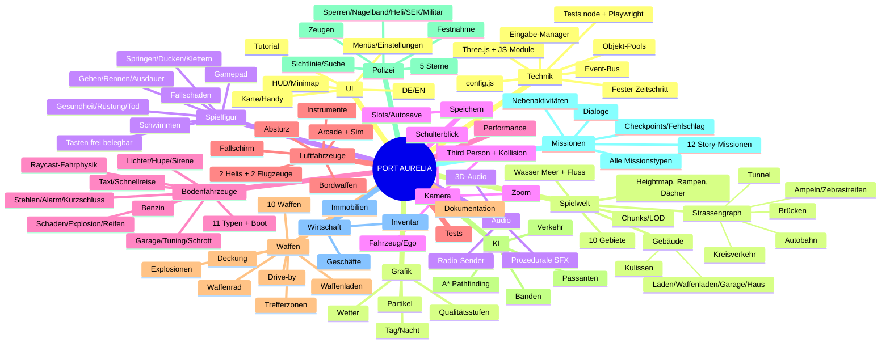

# MINDMAP – „PORT AURELIA“ (Open-World-Spiel im GTA-Stil, eigene Erfindung)

Legende: `[x]` erledigt · `[~]` vereinfacht umgesetzt · `[ ]` offen
Meilenstein-Zuordnung in Klammern (M0 … M12). Diese Datei wird während der Arbeit laufend abgehakt.

> Stand dieser Datei: siehe Abschnitt „Status“ ganz unten (wird bei jedem Meilenstein aktualisiert).

---

## Baumstruktur

```
PORT AURELIA
├── 1. Technik und Projektaufbau (M0)
│   ├── [ ] Technologie-Vergleich (≥3 Optionen) → TECH_ENTSCHEIDUNG.md
│   ├── [ ] Git-Repository, Branch, .gitignore
│   ├── [ ] Ordnerstruktur src/{core,world,player,vehicles,aircraft,weapons,ai,police,missions,economy,ui,audio,save,fx}
│   ├── [ ] Three.js lokal einbinden (vendor/, keine CDN-Abhängigkeit)
│   ├── [ ] Start ohne Installation: start.js (Node, ohne Abhängigkeiten) + Einzeldatei-Build dist/PortAurelia.html
│   ├── [ ] Spielschleife mit festem Physik-Zeitschritt (1/60 s, Akkumulator)
│   ├── [ ] Zentrale Eingabeverwaltung (Tastatur, Maus, Gamepad, Aktionen statt Tasten)
│   ├── [ ] Event-System (Pub/Sub-Bus)
│   ├── [ ] Konfigurationsdatei für alle Spielwerte (src/config.js)
│   ├── [ ] Objekt-Pooling (Projektile, Partikel, Passanten, Autos)
│   ├── [ ] Mathematische Hilfsfunktionen, Zufallsgenerator mit Seed
│   ├── [ ] Automatisierte Tests (node --test) für Logik-Module
│   └── [ ] Browser-Smoke-Test (Playwright, Screenshot, Fehlerprüfung, FPS)
│
├── 2. Spielwelt (M1)
│   ├── Stadtplan / Gebiete
│   │   ├── [ ] Innenstadt mit Hochhäusern
│   │   ├── [ ] Wohnviertel
│   │   ├── [ ] Industriegebiet
│   │   ├── [ ] Hafen (Kräne, Container, Docks)
│   │   ├── [ ] Strand / Küste
│   │   ├── [ ] Vorort
│   │   ├── [ ] Park
│   │   ├── [ ] Flughafen (Startbahn, Tower, Hangar)
│   │   ├── [ ] Militärgelände (Zaun, Wachen, Hubschrauber, Jet)
│   │   └── [ ] Berge / Land mit Wald
│   ├── Strassennetz
│   │   ├── [ ] Strassengraph (Knoten + Kanten als Polylinien)
│   │   ├── [ ] Kreuzungen
│   │   ├── [ ] Autobahn (Ring, breiter)
│   │   ├── [ ] Brücken über den Fluss
│   │   ├── [ ] Tunnel durch einen Berg
│   │   ├── [ ] Kreisverkehr
│   │   ├── [ ] Bürgersteige
│   │   ├── [ ] Zebrastreifen
│   │   └── [ ] Ampeln mit Phasen
│   ├── Gebäude
│   │   ├── [ ] Kulissengebäude mit Fenster-Texturen (prozedural)
│   │   ├── [ ] Betretbar: Läden (Laden-Innenraum)
│   │   ├── [ ] Betretbar: Waffenladen
│   │   ├── [ ] Betretbar: Garage
│   │   └── [ ] Betretbar: Haus des Spielers (Bett = Speichern)
│   ├── [ ] Wasser: Meer + Fluss, Schwimmen
│   ├── [ ] Höhenunterschiede (Heightmap), Rampen, Treppen, begehbare Dächer
│   ├── [ ] Tag-und-Nacht-Zyklus (→ Ast 13)
│   ├── [ ] Wettersystem (→ Ast 13)
│   ├── [ ] Minimap + Vollbildkarte mit Markierungen (→ Ast 12)
│   ├── [ ] Weltgrenze (Ozean + unsichtbare Wand)
│   └── [ ] Chunks mit Distanz-Streaming / LOD, Frustum Culling
│
├── 3. Spielfigur und Steuerung (M1)
│   ├── [ ] Gehen, Laufen, Rennen mit Ausdauer
│   ├── [ ] Springen, Ducken
│   ├── [ ] Klettern über niedrige Hindernisse
│   ├── [ ] Schwimmen (Ausdauer, Tauchen nicht)
│   ├── [ ] Fallen mit Fallschaden
│   ├── [ ] Kollision mit Gebäuden/Objekten (AABB + Höhenabfrage)
│   ├── [ ] Tastatur + Maus (Pointer Lock)
│   ├── [ ] Gamepad (Standard-Mapping)
│   ├── [ ] Frei belegbare Tasten
│   ├── [ ] Gesundheit, Rüstung, Ausdauer
│   ├── [ ] Tod → Krankenhaus mit Geldabzug
│   ├── [ ] Prozedurale Animationen: Stehen, Gehen, Rennen, Springen, Schwimmen, Schiessen, Ein-/Aussteigen
│   └── [ ] Rettung: Stuck-Erkennung, Durch-Boden-Fallen → Reset
│
├── 4. Kamera (M1)
│   ├── [ ] Dritte-Person-Orbitkamera mit Maus
│   ├── [ ] Kamera-Kollision (Raycast gegen Gebäude)
│   ├── [ ] Über-die-Schulter-Zielmodus
│   ├── [ ] Fahrzeugkamera (Verfolger), Ego-Perspektive im Fahrzeug
│   ├── [ ] Flugkamera (weiter weg, folgt Rollachse leicht)
│   └── [ ] Zoom beim Scharfschützengewehr
│
├── 5. Fahrzeuge am Boden (M2)
│   ├── Typen
│   │   ├── [ ] Kleinwagen  ├── [ ] Limousine  ├── [ ] Sportwagen
│   │   ├── [ ] SUV/Pickup   ├── [ ] Lastwagen   ├── [ ] Bus
│   │   ├── [ ] Motorrad     ├── [ ] Polizeiauto ├── [ ] Krankenwagen
│   │   ├── [ ] Taxi         ├── [ ] Feuerwehr   └── [ ] Motorboot
│   ├── Fahrphysik (Raycast-Fahrzeug)
│   │   ├── [ ] Beschleunigen, Bremsen, Rückwärts
│   │   ├── [ ] Handbremse, Driften
│   │   ├── [ ] Lenken (geschwindigkeitsabhängig)
│   │   ├── [ ] Federung je Rad
│   │   ├── [ ] Gewicht, Schwerpunkt, Überschlagen
│   │   └── [ ] Fahrzeug zurücksetzen (Rettung)
│   ├── [ ] Werte pro Fahrzeug in config.js
│   ├── Schaden
│   │   ├── [ ] Schadensstufen (Verformung/Farbe dunkler, Teile)
│   │   ├── [ ] Rauch → Feuer → Explosion
│   │   └── [ ] Reifen platzen (Schuss)
│   ├── Lichter & Ton
│   │   ├── [ ] Scheinwerfer, Bremslichter, Blinker
│   │   └── [ ] Hupe, Sirene (Polizei, Krankenwagen, Feuerwehr)
│   ├── [ ] Benzin + Tankstellen
│   ├── Autos stehlen
│   │   ├── [ ] Fahrer herausziehen (wehrt sich / flieht / zieht Waffe)
│   │   ├── [ ] Parkende Autos: Scheibe einschlagen + Kurzschliessen (Wartezeit)
│   │   ├── [ ] Abgeschlossene Autos → Alarm, Aufmerksamkeit
│   │   └── [ ] Gestohlene Autos als gesucht erkannt
│   ├── Garage
│   │   ├── [ ] Fahrzeuge speichern / abholen
│   │   ├── [ ] Reparieren, Umlackieren
│   │   └── [ ] Tunen: Motor, Reifen, Panzerung
│   ├── [ ] Schrottplatz: gestohlene Autos verkaufen
│   └── [ ] Beifahrer, Taxi rufen, Schnellreise
│
├── 6. Luftfahrzeuge (M6)
│   ├── [ ] Kleiner Helikopter, [ ] Militärhubschrauber
│   ├── [ ] Propellerflugzeug, [ ] Düsenjet
│   ├── [ ] Arcade-Flugmodell + Simulationsmodus
│   ├── [ ] Flugzeug: Schub, Neigung, Rollen, Gieren, Landeklappen, Fahrwerk, Strömungsabriss
│   ├── [ ] Helikopter: Kollektiv, Zyklik, Heckrotor
│   ├── [ ] Start/Landung: Flughafen, Helipads, Dächer
│   ├── [ ] HUD-Instrumente: Höhe, Tempo, Neigung, Treibstoff, Kompass, Steigrate
│   ├── [ ] Absturz → Explosion → Tod
│   ├── [ ] Fallschirm
│   ├── [ ] Stehlbar (Flughafen, Militär mit Wachen)
│   └── [ ] Bordwaffen: MG + Raketen
│
├── 7. Waffen und Kampf (M3)
│   ├── [ ] Waffenrad + Hotkeys 1–0 + Mausrad
│   ├── [ ] Faust, Messer, Baseballschläger
│   ├── [ ] Pistole, MP, Schrotflinte, Sturmgewehr, Scharfschützengewehr
│   ├── [ ] Granaten, Raketenwerfer
│   ├── [ ] Munition, Nachladen, Magazin, Rückstoss, Streuung, Reichweite
│   ├── [ ] Trefferzonen Kopf/Körper/Beine
│   ├── [ ] Fadenkreuz, Zoom, Auto-Aim-Option
│   ├── [ ] Deckung hinter Objekten
│   ├── [ ] Schiessen aus dem fahrenden Auto
│   ├── [ ] Explosionen: Flächenschaden, Druckwelle, Feuer, Kettenreaktion (Autos, Tanks)
│   ├── [ ] Treffereffekte: Funken, Einschusslöcher, stilisierte Partikel
│   ├── [ ] Waffenladen (kaufen, Munition)
│   └── [ ] Waffen aufsammeln (Gegner, Boden)
│
├── 8. KI: Passanten, Verkehr, Gegner (M4)
│   ├── Passanten
│   │   ├── [ ] Gehen auf Gehwegen (Graph)
│   │   ├── [ ] Ampeln/Zebrastreifen beachten
│   │   ├── [ ] Gespräche (angedeutet, Sprechblasen)
│   │   ├── [ ] Fliehen, Panik bei Schüssen, Widerstand
│   │   └── [ ] Verhaltenstypen: friedlich, ängstlich, aggressiv, Wache
│   ├── Verkehr
│   │   ├── [ ] Spurhalten auf Strassengraph
│   │   ├── [ ] Ampeln, Kreuzungen
│   │   ├── [ ] Abstand halten, Hindernisse, Hupen
│   │   └── [ ] Dichte je Gebiet und Tageszeit
│   ├── Banden
│   │   ├── [ ] Reviere (2 Banden)
│   │   ├── [ ] Gruppenangriff, Flankieren (vereinfacht)
│   │   ├── [ ] Deckung, Flucht, Verstärkung rufen
│   └── [ ] Pathfinding: A* auf Strassengraph + A* auf Gitter (zu Fuss)
│
├── 9. Polizei und Fahndung (M5)
│   ├── [ ] 1–5 Sterne, Verbrechen → Punkte
│   ├── [ ] Stufen: Fusspatrouille, Streifenwagen, Strassensperren, Nagelbänder, Helikopter, SEK, Militär
│   ├── [ ] Sichtlinie, Suchradius, Abklingen
│   ├── [ ] Autowechsel unbeobachtet → Fahndung sinkt
│   ├── [ ] Festnahme → Waffen/Geld weg, Polizeistation
│   ├── [ ] Tod → Krankenhaus
│   └── [ ] Zeugen melden Verbrechen
│
├── 10. Missionen und Story (M7)
│   ├── [ ] Story: Protagonist, Auftraggeber, Gegenspieler (eigene Erfindung)
│   ├── [ ] ≥10 Hauptmissionen (12)
│   ├── Missionstypen
│   │   ├── [ ] Verfolgungsjagd  ├── [ ] Auto stehlen + abliefern
│   │   ├── [ ] Schiesserei/Bandenkampf  ├── [ ] Lieferung mit Zeitlimit
│   │   ├── [ ] Hubschrauber-Mission  ├── [ ] Flugzeug-Mission
│   │   ├── [ ] Raubüberfall (Planung, Ausführung, Flucht)
│   │   ├── [ ] Schleichmission  ├── [ ] Rennen mit Checkpoints
│   │   └── [ ] Bosskampf
│   ├── [ ] Missions-Engine: Auftraggeber, Kartenmarker, Zwischenziele, Zeitlimit, Fehlschlag, Checkpoint-Neustart
│   ├── [ ] Dialogboxen mit Untertiteln (+ Sprachsynthese optional)
│   ├── Nebenaktivitäten
│   │   ├── [ ] Taxi  ├── [ ] Krankenwagen  ├── [ ] Feuerwehr
│   │   ├── [ ] Polizei-Einsätze  ├── [ ] Strassenrennen
│   │   ├── [ ] Stunts/Sprünge  └── [ ] Kopfgeldjagd
│   ├── [ ] Belohnungen: Geld, Waffen, Fahrzeuge, Freischaltungen
│   └── [ ] Missionsstatistik + Fortschritt in %
│
├── 11. Wirtschaft, Geschäfte, Inventar (M8)
│   ├── [ ] Einnahmen: Missionen, Raub, Autoverkauf, Aktivitäten
│   ├── [ ] Waffenladen  ├── [ ] Kleidung  ├── [ ] Autohändler
│   ├── [ ] Tankstelle   ├── [ ] Restaurant ├── [ ] Frisör  ├── [ ] Tuning
│   ├── [ ] Immobilien: Unterschlupf kaufen (Speichern, Parken)
│   ├── [ ] Inventar: Waffen, Munition, Medikits, Westen, Gegenstände
│   └── [ ] Preise in config.js
│
├── 12. Benutzeroberfläche und Menüs (M9)
│   ├── [ ] HUD: Gesundheit, Rüstung, Ausdauer, Geld, Waffe/Munition, Sterne, Uhr, Minimap, Ziel, Tacho, Instrumente
│   ├── [ ] Hauptmenü, Pausenmenü
│   ├── [ ] Einstellungen: Grafik, Ton, Steuerung (Tastenbelegung), Sprache
│   ├── [ ] Karte (Vollbild, Wegpunkt), Missionsübersicht, Statistiken, Inventar
│   ├── [ ] Handy: Kontakte, Missionen, Taxi, Schnellreise
│   ├── [ ] Tutorial-Hinweise beim ersten Start
│   ├── [ ] Ladebildschirm mit Fortschritt
│   └── [ ] Sprache Deutsch / Englisch
│
├── 13. Grafik, Licht, Tag/Nacht, Wetter (M10)
│   ├── [ ] Sonne/Mond, Himmelsfarbe, Hemisphärenlicht, Schatten
│   ├── [ ] Tag/Nacht: Laternen, Fahrzeuglichter, beleuchtete Fenster
│   ├── [ ] Wetter: klar, bewölkt, Regen, Nebel, Gewitter (Blitz)
│   ├── [ ] Wolken, Wasser (animiert), Nebel
│   ├── [ ] Partikel: Rauch, Feuer, Funken, Explosion, Regen, Staub
│   ├── [ ] Stilisierte Low-Poly-Optik, prozedurale Texturen
│   └── [ ] Qualitätsstufen niedrig/mittel/hoch, LOD, Culling
│
├── 14. Audio und Musik (M10)
│   ├── [ ] Prozedural (Web Audio): Motor je Fahrzeug, Schüsse, Explosionen, Schritte
│   ├── [ ] Umgebung, Regen, Verkehr, Sirenen, Rotor, Hupe
│   ├── [ ] Autoradio mit mehreren Sendern (prozedural erzeugte Musik)
│   ├── [ ] Räumliches 3D-Audio (PannerNode)
│   └── [ ] Lautstärkeregler (Master, Effekte, Musik)
│
├── 15. Speichern und Laden (M11)
│   ├── [ ] Mehrere Slots + Autosave
│   ├── [ ] Autosave an Missions-Checkpoints
│   ├── [ ] Manuelles Speichern in Unterkünften
│   ├── [ ] Daten: Position, Geld, Waffen, Munition, Garage, Missionen, Fahndung, Zeit, Einstellungen
│   └── [ ] Versionierung + Tests
│
├── 16. Physik und Weltinteraktion (M2–M4)
│   ├── [ ] Kollisionen Spieler/Fahrzeug/Gebäude/Objekte
│   ├── [ ] Zerstörbare Objekte: Laternen, Zäune, Briefkästen, Schilder, Hydranten
│   ├── [ ] Ragdoll (vereinfacht: Umkippen mit Impuls)
│   ├── [ ] Fussgänger anfahren → Fahndung
│   └── [ ] Objekte aufheben, werfen, umstossen
│
├── 17. Performance und Optimierung (M12)
│   ├── [ ] Fester Physik-Zeitschritt, Akkumulator-Kappung
│   ├── [ ] Geometrie-Merging pro Chunk, geteilte Materialien
│   ├── [ ] Spatial Hash für Kollisionen
│   ├── [ ] KI-Despawn/Respawn um den Spieler (Pooling)
│   ├── [ ] Sichtweite/Schatten/Pixelratio je Qualitätsstufe
│   └── [ ] FPS-Anzeige (F3)
│
├── 18. Tests und Fehlerbehebung (alle M)
│   ├── [ ] Unit-Tests: Konfiguration, Waffen, Fahndung, Missionen, Speichern, Pathfinding, Wirtschaft
│   ├── [ ] Smoke-Test im Headless-Browser je Meilenstein
│   ├── [ ] Rettungen: Stuck, Fall durch Boden, Überschlag, Mission-Neustart
│   └── [ ] BEKANNTE_FEHLER.md
│
└── 19. Dokumentation und Auslieferung (M12)
    ├── [ ] README.md (Beschreibung, Voraussetzungen, Start, Tastenbelegung)
    ├── [ ] TECH_ENTSCHEIDUNG.md
    ├── [ ] ENTWICKLUNGSLOG.md
    ├── [ ] BEKANNTE_FEHLER.md
    ├── [ ] ANFORDERUNGEN_CHECKLISTE.md
    ├── [ ] ZWISCHENSTAND.md
    ├── [ ] LIZENZEN.md (Quellen)
    └── [ ] Screenshots (docs/screenshots)
```

---

## Mermaid-Diagramm



---

## Status

Wird bei jedem Meilenstein aktualisiert. Aktueller Stand: **M0 – Planung (alle Punkte noch offen bis auf Planung)**.
